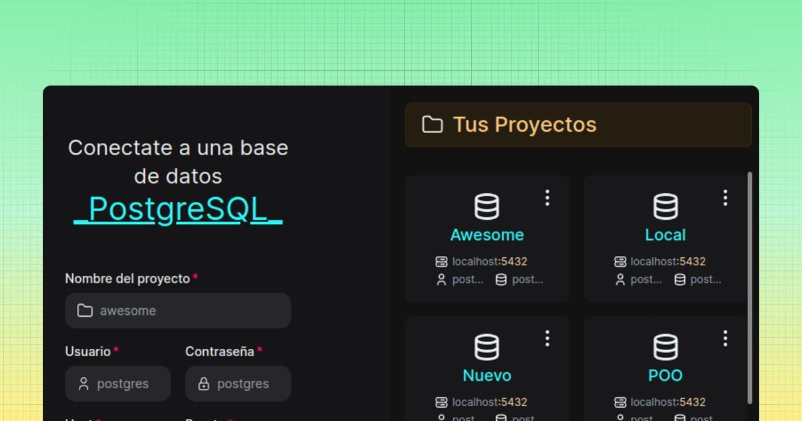

# MkApi

Aplicación de escritorio que permite administrar bases de datos PostgreSQL para gestionar sus tablas, ejecutar consultas SQL, leer archivos SQL, gestionar de copias de seguridad, automatizar la creación de una API, editor de texto y otras funciones.



## Project Setup

### Install

```bash
$ pnpm install
```

### Development

```bash
$ pnpm dev
```

### Build

```bash
# For windows
$ pnpm build:win

# For macOS
$ pnpm build:mac

# For Linux
$ pnpm build:linux
```
